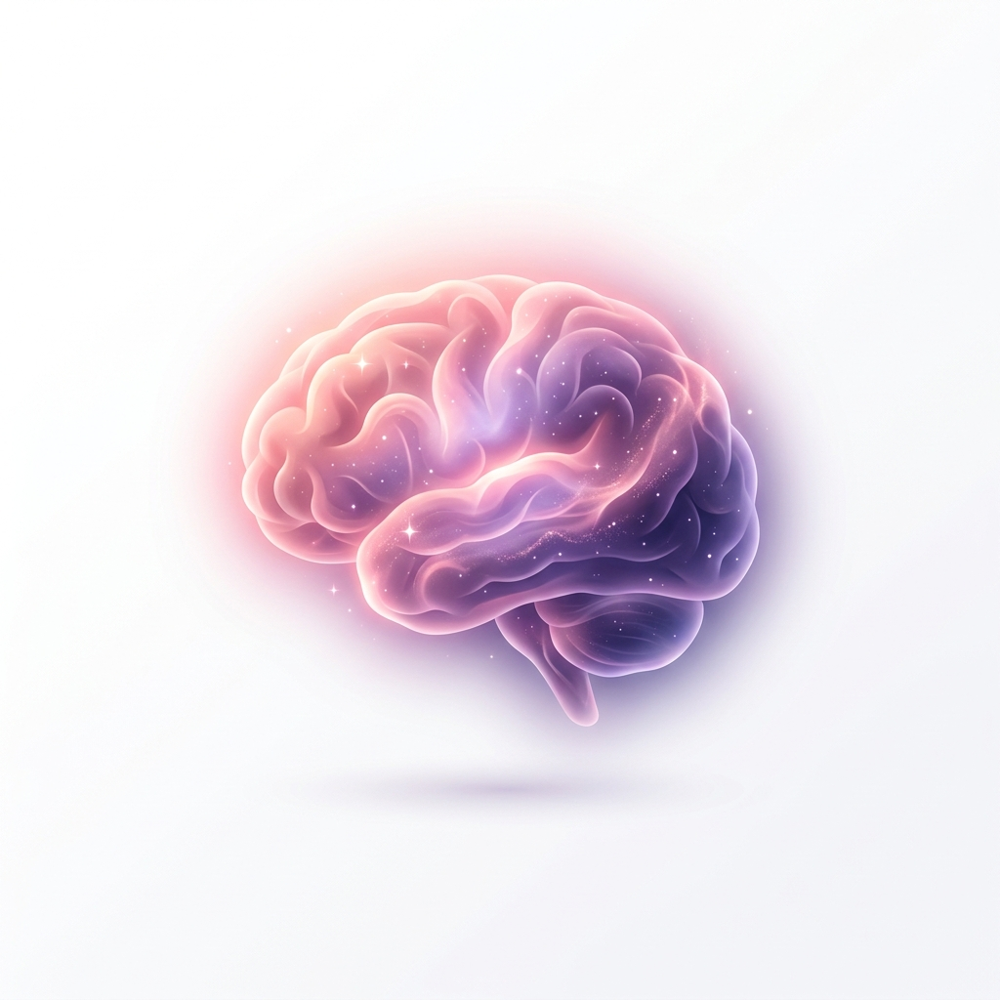

#  MindSpace: Your Sanctuary for Mental Clarity

> **Transform mental noise into structured peace. A high-end, meditative space designed to help you find your path forward with intentional clarity.**

MindSpace is a premium sanctuary for your thoughts. It provides a sophisticated environment to offload mental clutter, categorize your internal state, and receive a beautifully structured roadmap for your day. Built with a deep commitment to **Calm, Fun, and Premium** aesthetics, every interaction is designed to soothe the mind and spark joy.

---

## ✨ The Experience

- **🧠 Deep Brain Dump**: A serene, distraction-free space to let everything out without judgment.
- **⚡ Energy Alignment**: Automatic analysis of your mental state to tailor a workspace that meets you where you are.
- **📊 Clarity Dashboard**: High-fidelity bento cards that transform your noise into a prioritized, actionable "Focus," "Gentle Steps," and "Wait Until Later" plan.
- **🌅 A Living Journey**: A scrollable, visual story of your mental progress and energy shifts, helping you see how far you've come.
- **🛡️ Intentional Privacy**: Integrated safe-space settings designed to protect your most sensitive reflections.

---

## 🎨 Design Philosophy

MindSpace is built on the **"Candy" Design System**:
- **Squishy Micro-interactions**: Every touch matters. We use spring-based physics for deep tactile engagement—making the digital feel physical.
- **Fluid Ambient Motion**: "Breathing" background textures and graceful transitions ensure the experience never feels static or hurried.
- **Editorial Aesthetic**: Tighter tracking for headlines and elegant letter-spacing for labels, creating a high-end magazine feel.
- **Serene Dark Mode**: Optimized for mindful sessions, using deep, vibrant accents that are gentle on the eyes and the mind.

---

## 📜 Vision

MindSpace isn't just an app; it's a commitment to your mental well-being. By focusing on structured simplicity and premium aesthetics, we aim to make the act of organization feel as therapeutic as the result.

---

*Made with 💖 for a clearer mind.*
